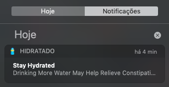

# HidratadO
Application for help you stay hydrated.

<p align="center">
  
</p>

# Features
* Remind yourself to drink water periodically

# Prerequisites
* [Node.js](https://nodejs.org/en/)

# Running
### 1. Run
````
# Install dependencies
npm install

# Start
npm start
````

### 2. Build Windows
````
# Package
npm run dist

# Get your version
dist/HidratadO.exe
````

### 3. Build MacOS
````
# Package
npm run dist

# Get your version
dist/HidratadO.app
````

# Built With
* [Node.js](https://nodejs.org/en/)
* [Electron](https://electronjs.org/)

# Authors
* [xxgicoxx](https://github.com/xxgicoxx)

# Acknowledgments
* [FlatIcon](https://www.flaticon.com/)